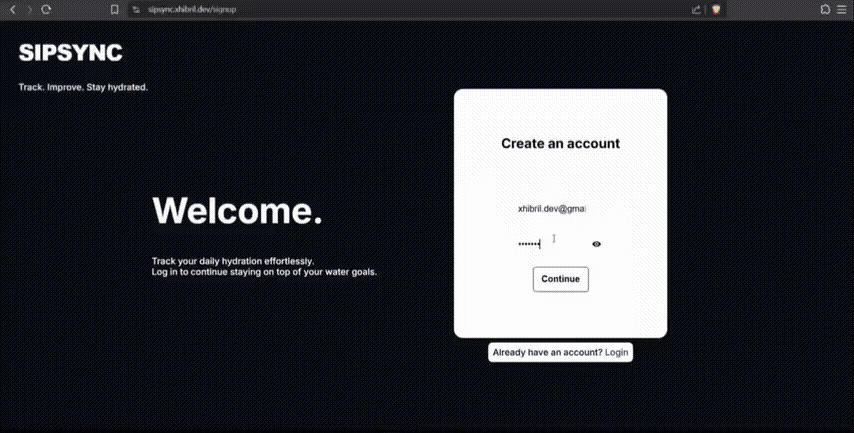

# SipSync

SipSync is a full-stack web application for tracking daily water intake.




## Overview
SipSync allows users to register, authenticate, log water consumption, and view progress over time.

## Tech Stack ▪️
- Java 17
- Spring Boot
- MySQL
- HTML, CSS, JavaScript

## Features ▫️
- Secure user accounts with verified access
- Request throttling to prevent abuse
- Hydration logging with history
- Streak progress tracking

## Run Locally ⚙️

**Requirements:** Java 17+, Maven, and MySQL.

```bash
git clone https://github.com/xhibril/SipSync.git
cd SipSync
mvn spring-boot:run
