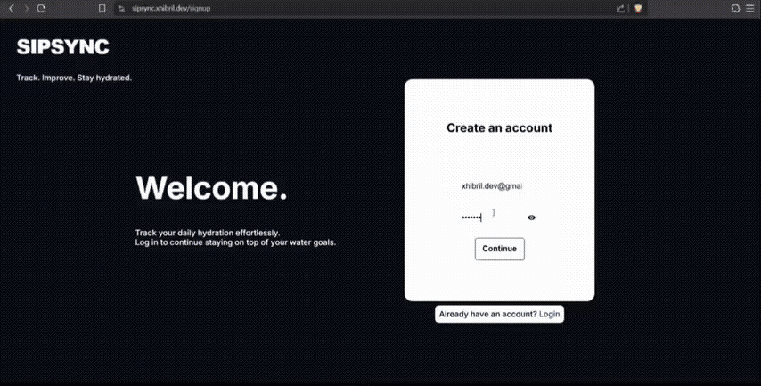

# SipSync

Full-stack web app for tracking daily water intake.



## Overview

Track daily hydration and monitor progress over time.

## Tech Stack

* Java 17
* Spring Boot
* MySQL
* HTML, CSS, JavaScript

## Features

* User authentication
* Water intake logging
* Progress tracking
* Rate limiting

## Run Locally

```bash
git clone https://github.com/xhibril/SipSync.git
cd SipSync
mvn spring-boot:run
```
